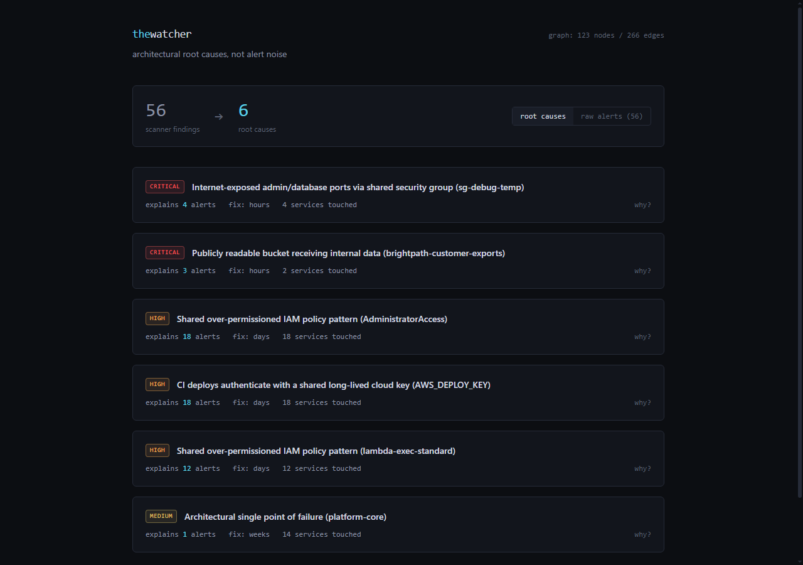

# The Watcher

[](https://github.com/Lucas-Maingi/the-watcher/actions/workflows/ci.yml)

Architectural security intelligence. Instead of dumping 200 scanner alerts on you, The Watcher builds a structural graph of your stack — repos, CI pipelines, IAM roles, buckets, security groups, and the trust relationships between them — then reasons over it to find the handful of *architectural root causes* actually generating those alerts.

The pitch in one line: a single over-permissioned IAM pattern copy-pasted across 40 services produces 40+ scanner findings. Fix the pattern once, all 40 go away. Every tool I've used shows me the 40. Nobody shows me the one.

On the built-in demo company: **56 scanner-style findings collapse to 6 root causes**, each with a reasoning trace, a blast-radius estimate, and a fix.



## Quick start (no cloud account needed)

```bash
docker compose up --build
# dashboard at http://localhost:8080, api at http://localhost:8000/docs
```

Or without Docker:

```bash
cd backend
pip install -e ".[connectors,api,agent]"
watcher ingest --demo          # builds the Brightpath demo graph
watcher report                 # root causes in the terminal
uvicorn watcher.api.main:app --port 8000   # then `npm run dev` in frontend/
```

Set `ANTHROPIC_API_KEY` and the "how we got here" narratives are written by Claude; without it you get honest offline templates and everything else works identically. The demo never depends on API quota.

## Against real infrastructure

```bash
watcher ingest --github your-org --token ghp_...   # repos, manifests, actions workflows
watcher ingest --aws --merge                       # iam, sgs, s3, lambda (read-only)
watcher report
```

Both connectors are strictly read-only. The minimum IAM policy the AWS connector needs is in [docs/aws-readonly-policy.json](docs/aws-readonly-policy.json) — using `ReadOnlyAccess` for a tool like this would be ironic.

## For coding agents

The reasoning engine is exposed as four MCP tools ([backend/watcher/tools.py](backend/watcher/tools.py) is the contract, the docs are in the docstrings):

```bash
claude mcp add watcher -- python -m watcher.mcp_server
```

`get_context_for("services/payments/handler.py")` returns the architectural root causes touching that service — the shared IAM template it inherits, the CI key its deploys use — not lint output. `get_root_causes`, `explain_finding` and `get_blast_radius` do what they say.

## How it works

```
connectors ──> property graph ──> deterministic detectors ──> clustering ──> llm narrative
 (github,       (networkx +        (emit signals tagged        (same root      (claude, or
  aws, demo)     json snapshot)     with their root NODE)       = same cause)   templates)
```

The design decision that makes it work: detectors don't just flag resources, they record **which graph node structurally causes each signal** plus the exact traversal as a reasoning trace. Clustering is then trivial — signals sharing a root node are symptoms of the same disease. The LLM only writes prose; it cannot add, remove or re-score findings. Detection stays reproducible and auditable, explanation gets to be human.

Blast radius is exact where the graph can answer (which services, which resources) and banded where it can't (effort as hours/days/weeks — a precise number for a cross-team IAM migration would be fiction).

### Why NetworkX and not Neo4j

For a graph of a few thousand nodes, a JVM database in Docker buys nothing except a slower dev loop and one more thing to break during a live demo. NetworkX in-process with JSON snapshots is plenty, and the queries are plain Python. The store is behind one interface ([store.py](backend/watcher/graph/store.py)); if this ever holds a real enterprise estate, swapping it is a contained job.

## How this compares to Wiz, Snyk, Prowler

Not a fair fight on coverage, so let's not pretend: commercial CSPMs and scanners check thousands of rules across every cloud service; The Watcher ships five detectors over a phase-1 AWS/GitHub surface. If you need breadth today, buy breadth.

What none of them give you is the thing this project exists to demonstrate:

- **Root-cause clustering, not deduplication.** Wiz and friends group similar findings by *rule* ("14 buckets are public"). The Watcher groups by *structural cause* — the one Terraform module or IAM template that, when fixed, makes all 14 disappear. Same-rule grouping tells you what's wrong; same-root grouping tells you what to change.
- **Auditable reasoning traces.** Every finding carries the exact graph traversal that produced it (`policy → attached role → assuming principal`), and there's a test asserting every trace only references nodes that exist. Scanner findings are assertions; these are arguments you can check.
- **The LLM is decorative by design.** Detection is deterministic Python; Claude only writes the narrative prose and cannot add, remove, or re-score a finding. Most "AI security" products invert this and inherit the hallucination risk in the part that matters.
- **Local-first and agent-native.** Runs against a JSON snapshot on your laptop, no SaaS tenant, and exposes the reasoning engine as MCP tools so a coding agent can ask "what architectural debt touches the file I'm editing" mid-refactor.

The honest framing: this is the *reasoning layer* those products are missing, built small enough to audit end-to-end, not a replacement for their collection layer.

## Honest limitations

Things this does **not** do yet, so nobody has to discover them the hard way:

- **AWS coverage is the phase-1 set** (IAM, SGs, S3, Lambda). No permission boundaries, no SCPs, no resource policies beyond S3, no cross-account analysis, no VPC topology. `Condition` blocks in policies are ignored — a wildcard scoped by conditions still flags.
- **GitHub connector** parses `package.json` / `requirements.txt` / Actions workflows. No lockfiles, no transitive dependencies, no other CI systems.
- **Repo↔cloud linking is weak on real data.** In the demo, services connect naturally; against a live account, mapping "this repo deploys that lambda" relies on the CI workflow parsing and misses anything deployed by hand.
- **Blast-radius effort bands are heuristics** encoded in [blast_radius.py](backend/watcher/reasoning/blast_radius.py). Auditable, but still opinions.
- **Compliance mapping is a lookup table** from rule to ISO 27001 / SOC 2 control categories. It is not an audit tool.
- Detectors cover five structural patterns. That's honest coverage of the classes I most wanted to demonstrate, not breadth parity with a commercial scanner — the architecture makes adding detectors cheap (one function each in [detectors.py](backend/watcher/reasoning/detectors.py)).

## Reading order

- [docs/case-study.md](docs/case-study.md) — the before/after walkthrough on the demo company
- [backend/watcher/reasoning/](backend/watcher/reasoning/) — the actual IP: detectors, clustering, blast radius
- [backend/watcher/ingest/demo.py](backend/watcher/ingest/demo.py) — the fake company and what's deliberately wrong with it
- `python -m pytest backend/tests` — 16 tests, including the one that proves every reasoning trace only references nodes that exist
